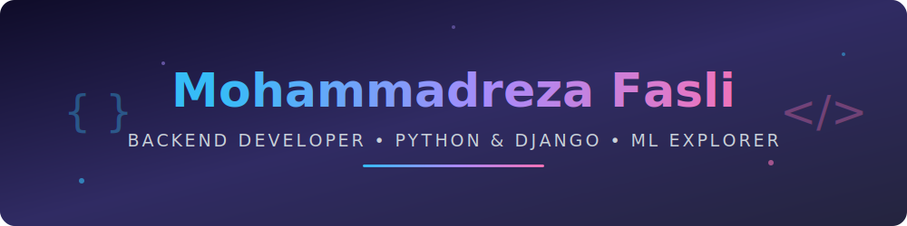

<!-- Custom Animated Header (hosted in this repo — always loads!) -->
<div align="center">



<!-- Typing Animation -->

[](https://readme-typing-svg.demolab.com)

<!-- Badges Row -->


[](https://github.com/mohammadreza829?tab=followers)
[](https://mrfasli.ir)
[](mailto:mohammadrezafasli1234@gmail.com)

</div>

---

## 🚀 About Me

```python
class Mohammadreza:
    def __init__(self):
        self.role = "Backend Developer"
        self.education = "Computer Engineering Student"
        self.language_spoken = ["fa_IR", "en_US"]
        self.stack = ["Python", "Django", "DRF", "PostgreSQL"]
        self.currently_learning = ["Machine Learning", "Deep Learning"]

    def say_hi(self):
        print("Thanks for dropping by! Let's build something cool 🚀")


me = Mohammadreza()
me.say_hi()
```

- 🎓 I'm a **Computer Engineering student** who got into backend development and stuck with it
- 🐍 Most of what I build is with **Python & Django** — from small practice apps to full platforms with REST APIs, authentication, and real database design
- 🤖 Currently heading toward **Machine Learning**: training models and figuring out how to actually **serve them behind an API** instead of leaving them in a notebook
- 🌐 Check out my website: [mrfasli.ir](https://mrfasli.ir)

---

## 🛠️ Tech Stack

<div align="center">

### Languages & Frameworks


### Databases


### Tools & Learning


<br>


</div>

---

## 📌 Featured Projects

| 🚀 Project | 📝 Description |
|-----------|----------------|
| 🎓 **MaktabPlus** | Online learning platform (LMS) split into several Django apps: courses & lessons, race-condition-safe enrollment, quizzes, per-course chat, and an AI study assistant |
| ✍️ **[Weblog](https://github.com/mohammadreza829/weblog)** | Persian, RTL-first blog platform with a full editorial workflow, comments, and a ticket-based support system |
| 📅 **Appointment & Booking** | Django REST API paired with a React frontend for booking appointments and hotel stays |
| 📸 **Instagram-style social app** | Image uploads, follow system, feed, likes, and comments |
| 🏫 **[School Management System](https://github.com/mohammadreza829/django_SchoolManagementSystem)** | Django-based school management platform |
| 🐭 **[Mouse Maze Pathfinder](https://github.com/mohammadreza829/mouse-maze-pathfinder)** | Pathfinding algorithms visualized in a maze solver |

---

## 📊 GitHub Stats

<div align="center">


<br><br>


</div>

---

## 📈 Contribution Graph

<div align="center">

[](https://github.com/mohammadreza829)

</div>

---

## 📫 Get in Touch

<div align="center">

[](https://mrfasli.ir)
[](mailto:mohammadrezafasli1234@gmail.com)
[](https://github.com/mohammadreza829)

<br>

### ⭐️ If you like my projects, give them a star!


</div>
